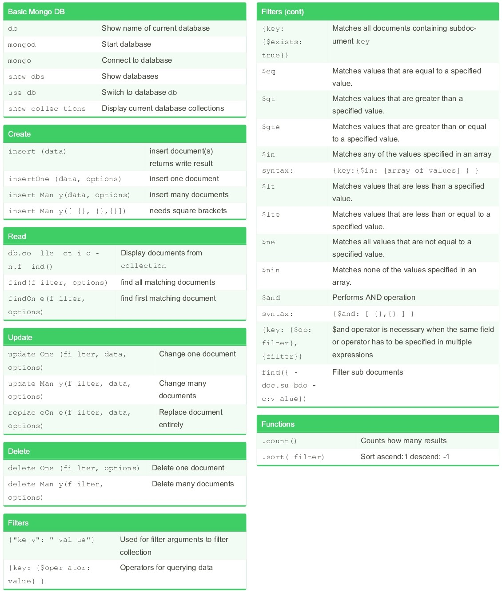

# MongoDB Interview Questions & Answers

### Table of Contents

| Questions                                                                                                                       |
| ------------------------------------------------------------------------------------------------------------------------------- |
| [What is MongoDB](#What-is-MongoDB)                                                                                             |
| [Feature of MongoDB](#Feature-of-MongoDB)                                                                                       |
| [What are the data types in MongoDB](#What-are-the-data-types-in-MongoDB)                                                       |
| [Advantage and Disadvantage of MongoDB](#Advantage-and-Disadvantage-of-MongoDB)                                                 |
| [Applications of MongoDB](#Applications-of-MongoDB)                                                                             |
| [What is a primary key in MongoDB](#What-is-a-primary-key-in-MongoDB)                                                           |
| [What is Difference Between MySQL and MongoDB](#What-is-Difference-Between-MySQL-and-MongoDB)                                   |
| [What is Difference Between MySQL and NoSQL](#What-is-Difference-Between-MySQL-and-NoSQL)                                       |
| [How does MongoDB differ from traditional relational databases](#How-does-MongoDB-differ-from-traditional-relational-databases) |
| [How does MongoDB store data](#How-does-MongoDB-store-data)                                                                     |
| [What is BSON Data](#What-is-BSON-Data)                                                                                         |
| [What is Binary JSON](#What-is-Binary-JSON)                                                                                     |
| [What is Difference between BSON and JSON](#What-is-Difference-between-BSON-and-JSON)                                           |
| [What is Collections](#What-is-Collections)                                                                                     |
| [What is Document](#What-is-Document)                                                                                           |
| [What is Collection](#What-is-Collection)                                                                                       |
| [What is Mongoose](#What-is-Mongoose)                                                                                           |
| [What is Schema](#What-is-Schema)                                                                                               |
| [What are Dynamic Schemas](#What-are-Dynamic-Schemas)                                                                           |
| [What is Models](#What-is-Models)                                                                                               |
| [What do you mean by Transactions](#What-do-you-mean-by-Transactions)                                                           |
|                                                                                                                            |

---

### What is MongoDB

MongoDB is a NoSQL database known for its flexibility, scalability, and performance. It stores data in JSON-like documents (BSON), allowing for dynamic schema design.

**[⬆ Back to Top](#table-of-contents)**

---

### Feature of MongoDB

Key features of MongoDB include:

1. **Document-Oriented**: Stores data in flexible, JSON-like documents.
2. **Scalability**: Easily scales horizontally with sharding.
3. **Schema Flexibility**: Allows dynamic schema design.
4. **Indexing**: Supports diverse types of indexes for fast query performance.
5. **Aggregation Framework**: Provides powerful data aggregation capabilities.
6. **High Availability**: Ensures data redundancy and failover with replica sets.
7. **Geospatial Support**: Includes geospatial indexing and queries.
8. **Ad Hoc Queries**: Enables real-time queries for data exploration.

**[⬆ Back to Top](#table-of-contents)**

---

### What are the data types in MongoDB

MongoDB supports a variety of data types to store and manage data. Here are the primary data types available in MongoDB:

1. **String**: Used to store textual data. Strings must be UTF-8 encoded.

2. **Integer**: Used to store numerical values. MongoDB provides both 32-bit and 64-bit integers.

3. **Boolean**: Used to store a boolean (true/false) value.

4. **Double**: Used to store floating-point values.

5. **Min/Max Keys**: Used to compare a value against the lowest and highest BSON elements.

6. **Array**: Used to store arrays or lists of multiple values.

7. **Timestamp**: Used to store timestamp data. Useful for recording when a document has been modified or added.

8. **Object**: Used for embedded documents. This is the standard BSON object.

9. **Null**: Used to store a null value.

10. **Symbol**: Used to store string data, but intended for use with languages that distinguish between strings and symbols. Most languages do not use this type.

11. **Date**: Used to store the current date or time in UNIX time format (milliseconds since the epoch). MongoDB also includes support for querying dates.

12. **ObjectId**: Used to store unique identifier automatically generated for each document.

13. **Binary Data**: Used to store binary data. Typically used for storing files, images, etc.

14. **Code**: Used to store JavaScript code for execution on the database server.

15. **Regular Expression**: Used to store regular expressions.

16. **Decimal128**: Used for storing high-precision decimal values. Useful for financial and scientific calculations where precision is critical.

**[⬆ Back to Top](#table-of-contents)**

---

### Advantage and Disadvantage of MongoDB

### Advantages of MongoDB

1. **Flexible Schema**: Supports dynamic schema design, allowing for easy modification of data structures.
2. **Scalability**: Easily scales horizontally with sharding, distributing data across multiple servers.
3. **Performance**: Optimized for high read and write throughput, making it suitable for big data applications.
4. **Indexing**: Offers a variety of indexing options to improve query performance.
5. **Rich Query Language**: Provides a powerful query language for complex data retrieval and manipulation.
6. **Aggregation Framework**: Facilitates data aggregation operations such as filtering, grouping, and transforming data.
7. **High Availability**: Ensures data redundancy and failover with replica sets, enhancing reliability.
8. **Geospatial Features**: Supports geospatial queries and indexing for location-based data.

### Disadvantages of MongoDB

1. **Memory Usage**: High memory consumption due to the storage of data in BSON format.
2. **Complex Transactions**: Limited support for multi-document ACID transactions, which can complicate complex operations.
3. **Data Duplication**: Denormalization for performance can lead to data redundancy and inconsistency.
4. **Management Complexity**: Requires careful management of sharding and replica sets to ensure optimal performance and reliability.
5. **Lack of Joins**: No traditional join operations like relational databases, which can complicate queries involving multiple collections.
6. **Maturity**: While improving, some features and tools may not be as mature or robust as those in established relational databases.
7. **Learning Curve**: Requires a shift in mindset from traditional relational databases, which may involve a steep learning curve for new users.

**[⬆ Back to Top](#table-of-contents)**

---

### Applications of MongoDB

MongoDB is widely used in various applications and industries due to its flexibility, scalability, and performance. Some common applications of MongoDB include:

1. **Content Management**: Storing and managing content for websites and blogs due to its schema flexibility and ease of integration with web applications.

2. **Real-time Analytics**: Handling large volumes of data and providing real-time insights for analytics platforms.

3. **Mobile App Data Storage**: Serving as a backend database for mobile applications, supporting offline data storage and synchronization.

4. **E-commerce Platforms**: Managing product catalogs, user profiles, and transaction data efficiently.

5. **Internet of Things (IoT)**: Storing and analyzing data from IoT devices, which often generate large amounts of semi-structured or unstructured data.

6. **Personalization**: Supporting personalized content delivery and recommendations based on user behavior and preferences.

7. **Catalog Management**: Managing and organizing catalogs of items, such as in retail or media streaming services.

8. **User Data Management**: Storing and managing user profiles, preferences, and interactions in applications.

9. **Big Data Processing**: Serving as a component of big data processing pipelines, handling diverse data types and volumes.

10. **Social Media Platforms**: Managing social network data, user activities, and interactions efficiently.

**[⬆ Back to Top](#table-of-contents)**

---

### What is a primary key in MongoDB

In MongoDB, the `_id` field serves as the primary key for a document. It must be unique within a collection and is automatically generated if not provided during document insertion.

**[⬆ Back to Top](#table-of-contents)**

---

### What is Difference Between MySQL and MongoDB

Sure, here's a side-by-side comparison of MySQL and MongoDB in a table format:

| **Feature**                 | **MySQL**                                                                | **MongoDB**                                                                         |
| --------------------------- | ------------------------------------------------------------------------ | ----------------------------------------------------------------------------------- |
| **Type**                    | Relational Database Management System (RDBMS)                            | NoSQL Database                                                                      |
| **Data Model**              | Tables with rows and columns                                             | JSON-like documents in collections                                                  |
| **Schema**                  | Fixed, predefined schema                                                 | Schema-less or flexible schema                                                      |
| **Query Language**          | SQL                                                                      | MongoDB Query Language (JSON-based)                                                 |
| **Joins**                   | Supports complex joins                                                   | Limited support for joins; prefers embedding or application-level joins             |
| **Transactions**            | Strong ACID compliance, multi-statement transactions                     | Supports multi-document transactions (from version 4.0), less mature ACID           |
| **Scalability**             | Vertical scaling, horizontal scaling with complexity                     | Designed for horizontal scaling with sharding                                       |
| **Performance**             | Good for structured data and complex queries                             | Optimized for high throughput and large datasets                                    |
| **Use Cases**               | Financial systems, enterprise applications, traditional web applications | Content management, real-time analytics, IoT, big data applications                 |
| **Community and Ecosystem** | Large, established community, rich ecosystem                             | Strong and growing community, vibrant ecosystem                                     |
| **Consistency**             | Strong consistency                                                       | Eventual consistency, with support for strong consistency in certain configurations |
| **Flexibility**             | Less flexible, structured data                                           | Highly flexible, suitable for unstructured or semi-structured data                  |
| **Data Relationships**      | Enforces relationships through foreign keys                              | Handles relationships via embedded documents or references                          |
| **Indexing**                | Extensive indexing options                                               | Rich indexing capabilities, including geospatial and text indexes                   |
| **Development Speed**       | More formal schema design can slow development                           | Faster development cycles due to flexible schema                                    |

**[⬆ Back to Top](#table-of-contents)**

---

### What is Difference Between MySQL and NoSQL

Sure, here's a comparison between MySQL (a specific type of SQL database) and NoSQL databases in general:

| **Feature**                  | **MySQL (SQL)**                                                          | **NoSQL**                                                                                                             |
| ---------------------------- | ------------------------------------------------------------------------ | --------------------------------------------------------------------------------------------------------------------- |
| **Type**                     | Relational Database Management System (RDBMS)                            | Non-relational databases (various types)                                                                              |
| **Data Model**               | Tables with rows and columns                                             | Varies: documents, key-value pairs, wide-column stores, graph databases                                               |
| **Schema**                   | Fixed, predefined schema                                                 | Schema-less or flexible schema                                                                                        |
| **Query Language**           | SQL                                                                      | Varies: JSON-based queries, key-value methods, graph queries, etc.                                                    |
| **Joins**                    | Supports complex joins                                                   | Limited or no support for joins; varies by NoSQL type                                                                 |
| **Transactions**             | Strong ACID compliance, multi-statement transactions                     | Varies: some support ACID transactions, others focus on BASE (Basically Available, Soft state, Eventually consistent) |
| **Scalability**              | Vertical scaling, horizontal scaling with complexity                     | Designed for horizontal scaling; easier to scale out                                                                  |
| **Performance**              | Good for structured data and complex queries                             | Optimized for specific use cases, often high performance with large datasets                                          |
| **Use Cases**                | Financial systems, enterprise applications, traditional web applications | Real-time web apps, big data, content management, IoT, social networks                                                |
| **Community and Ecosystem**  | Large, established community, rich ecosystem                             | Varies by database type; many have strong communities and ecosystems                                                  |
| **Consistency**              | Strong consistency                                                       | Varies: can offer strong or eventual consistency based on configuration                                               |
| **Flexibility**              | Less flexible, structured data                                           | Highly flexible, suitable for unstructured or semi-structured data                                                    |
| **Data Relationships**       | Enforces relationships through foreign keys                              | Handled via embedded documents, references, or specific data models (e.g., graphs)                                    |
| **Indexing**                 | Extensive indexing options                                               | Varies: rich indexing capabilities, including special indexes (e.g., geospatial, text)                                |
| **Development Speed**        | More formal schema design can slow development                           | Faster development cycles due to flexible schema                                                                      |
| **Types of NoSQL Databases** | Not applicable                                                           | Document (e.g., MongoDB), Key-Value (e.g., Redis), Wide-Column (e.g., Cassandra), Graph (e.g., Neo4j)                 |

**[⬆ Back to Top](#table-of-contents)**

---

### How does MongoDB differ from traditional relational databases

| Feature                               | MongoDB                                                                                       | Traditional Relational Databases                                                                         |
| ------------------------------------- | --------------------------------------------------------------------------------------------- | -------------------------------------------------------------------------------------------------------- |
| **Data Model**                        | Document-oriented (BSON documents)                                                            | Tabular (rows and columns in tables)                                                                     |
| **Schema**                            | Schema-less / dynamic schema                                                                  | Rigid schema (predefined and strictly enforced)                                                          |
| **Scalability**                       | Horizontal scaling (sharding)                                                                 | Vertical scaling (adding power to a single server); some support horizontal scaling (partitioning)       |
| **Joins**                             | No traditional joins; uses aggregations and lookup operations                                 | Supports complex joins to combine data from multiple tables                                              |
| **Transactions**                      | Multi-document ACID transactions since version 4.0; single-document atomic operations         | Strong support for multi-statement ACID transactions                                                     |
| **Consistency and Availability**      | Configurable using replica sets and write concerns                                            | Prioritize consistency (ACID properties) over availability                                               |
| **Flexibility and Development Speed** | High flexibility; rapid development and iteration                                             | Requires upfront schema design; ensures data integrity and structure                                     |
| **Indexing**                          | Supports various indexes: single field, compound, multi-key, geospatial, text                 | Supports primary and secondary indexes                                                                   |
| **Replication and High Availability** | Built-in replication (replica sets) for redundancy and high availability                      | Typically supports replication for high availability                                                     |
| **Query Language**                    | Powerful query language with support for filtering, sorting, aggregations, geospatial queries | SQL with complex querying capabilities                                                                   |
| **Aggregation Framework**             | Rich aggregation framework for data transformation and analysis                               | GROUP BY and other SQL aggregation functions                                                             |
| **Geospatial Data**                   | Supports geospatial indexes and queries                                                       | Limited support for geospatial data, varies by implementation                                            |
| **Use Cases**                         | Flexible schemas, large datasets, rapid development (e.g., CMS, real-time analytics, IoT)     | Complex transactions, strict consistency, well-defined relationships (e.g., financial systems, ERP, CRM) |

**[⬆ Back to Top](#table-of-contents)**

---

### How does MongoDB store data

MongoDB stores data in BSON (Binary JSON) format, a binary-encoded serialization of JSON-like documents. These documents are stored in collections within databases.

**[⬆ Back to Top](#table-of-contents)**

---

### What is BSON Data

BSON (Binary JSON) is the binary-encoded serialization format used by MongoDB to store and transmit data. It extends JSON with additional data types such as ObjectId, Date, and binary data, optimizing storage and efficiency. BSON supports rich data structures and is essential for MongoDB's document-oriented storage and querying capabilities.

**[⬆ Back to Top](#table-of-contents)**

---

### What is Binary JSON

Binary JSON (BSON) is MongoDB's storage and network transmission format. It extends JSON by encoding data in a binary representation, enhancing efficiency and supporting additional data types like dates and binary data, crucial for MongoDB's document-oriented database operations.

**[⬆ Back to Top](#table-of-contents)**

---

### What is Difference between BSON and JSON

Here's a comparison of BSON (Binary JSON) and JSON (JavaScript Object Notation) in a table format:

| **Feature**       | **JSON**                                                                          | **BSON**                                                                       |
| ----------------- | --------------------------------------------------------------------------------- | ------------------------------------------------------------------------------ |
| **Format**        | Text-based                                                                        | Binary                                                                         |
| **Data Types**    | Limited (strings, numbers, booleans, arrays, objects, null)                       | Extended (includes additional types like dates, binary data)                   |
| **Readability**   | Human-readable                                                                    | Not human-readable (binary format)                                             |
| **Efficiency**    | Larger size, less efficient for storage and transmission of large volumes of data | Smaller size, more efficient for storage and transmission due to binary format |
| **Usage**         | Typically used for data interchange between systems, configuration files          | Specifically designed for MongoDB storage and network communication            |
| **Support**       | Widely supported by many programming languages and systems                        | Supported primarily by MongoDB and its drivers                                 |
| **Null Values**   | Supports `null` values                                                            | Supports `null` values                                                         |
| **Extensions**    | No extensions beyond the core JSON data types                                     | Extends JSON with additional data types like ObjectId, Date, Binary Data       |
| **Usage Context** | General-purpose data interchange format                                           | Specifically tailored for database storage and querying (MongoDB)              |

**[⬆ Back to Top](#table-of-contents)**

---

### What is Collections

**Collections**: Groups of MongoDB documents, equivalent to tables in relational databases, but without a fixed schema.

**[⬆ Back to Top](#table-of-contents)**

---

### What is Document

**Document**: A single record in a MongoDB collection, stored in JSON-like format called BSON (Binary JSON).

**[⬆ Back to Top](#table-of-contents)**

---

### What is Collection

**Collection**: A grouping of MongoDB documents, similar to a table, but more flexible and schema-less.

**[⬆ Back to Top](#table-of-contents)**

---

### What is Mongoose

Mongoose is an Object Data Modeling (ODM) library for MongoDB and Node.js, providing schema-based data validation and query building.

A library that creates a connection between MongoDB and Node.js JavaScript Runtime Environment. It is an ODM (Object Data Modeling) Library.

**Note :**

- Mongoose uses Operation Buffering.
- Mongoose lets you start using your models immediately, without waiting for mongoose to establish a connection to monogoDB.

**[⬆ Back to Top](#table-of-contents)**

---

### What is Schema

A schema defines the structure and constraints of data in a database, specifying fields, types, and relationships within tables or documents.

**[⬆ Back to Top](#table-of-contents)**

---

### What are Dynamic Schemas

Dynamic schemas in MongoDB allow documents in the same collection to have different structures, enabling flexible and evolving data models.

**[⬆ Back to Top](#table-of-contents)**

---

### What is Models

Models define and manage data access, representing documents and enabling interaction with the database using schemas.

**[⬆ Back to Top](#table-of-contents)**

---

### What do you mean by Transactions

A transaction is a logical unit of processing in a database that includes one or more database operations, which can be read or write operations. Transactions provide a useful feature in MongoDB to ensure consistency.

MongoDB provides two APIs to use transactions.

**Core API:** It is a similar syntax to relational databases (e.g., start_transaction and commit_transaction)
**Call-back API:** This is the recommended approach to using transactions. It starts a transaction, executes the specified operations, and commits (or aborts on the error). It also automatically incorporates error handling logic for "TransientTransactionError" and "UnknownTransactionCommitResult".

**[⬆ Back to Top](#table-of-contents)**

---

###

**[⬆ Back to Top](#table-of-contents)**

---

For More Information: [Link](https://www.mongodb.com/developer/products/mongodb/cheat-sheet/)https://www.mongodb.com/developer/products/mongodb/cheat-sheet/
